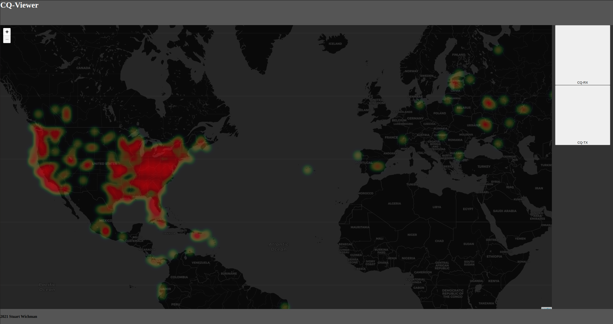

# cq-viewer



Visualize CQ reports received with psk reporting software.


This software will take WSJT-X logs and parse out the CQ's, and make a heatmap of them. The heatmaps are generated using [leaf-heat](https://github.com/Leaflet/Leaflet.heat) for the [leaflet](https://leafletjs.com/) map system.


## Installation
Never tried to install, but you can run this to install dependencies from the project root directory:
```sh
pip install -e .
```

You will need to put the ALL.TXT from the WSJT-X software into the example_data folder. then you can run the script with:
```sh
python3 cqviewer.py
```
This will be fixed to point at the WSJT-X data directly, or any data in the next version. Another addition coming up will be an update to the map on an interval (2 minutes'ish).

Next major steps will be to remove the storage of the CQ data to a variable in a .js file, and instead build into a database. This will allow for smoother updates of a database, rather than a wholesale processing of data. This, in turn, would allow for a more efficient method to keep the html open in a browser, and have the map update with new CQ receipts from WSJT-X.
